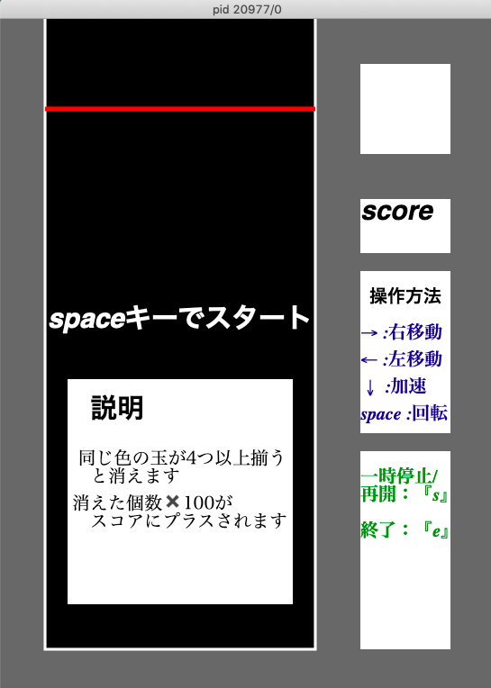
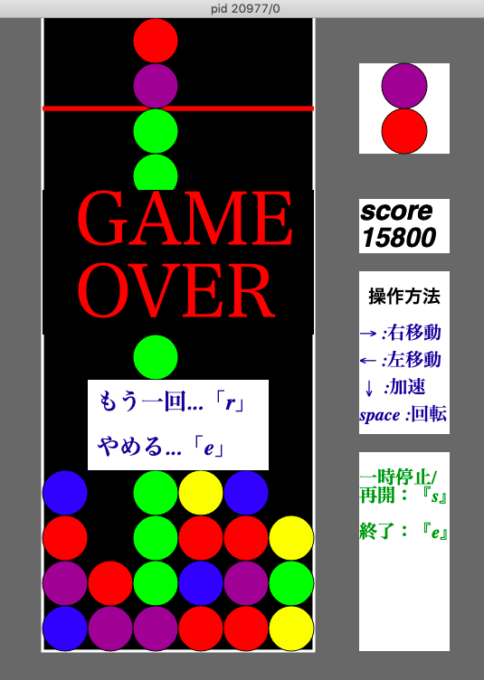

# puyo
ぷよぷよを模倣したゲームを作りました。 
 
玉が2つずつ落ちてくるので、それを積み上げて行きます。同じ色の玉が4つ以上隣り合うと消えます。
玉の色は５色の中からランダムで決まり、落下速度は時が経つにつれて速くなっていきます。
 
## 操作方法
→（十字キー右）：　1マス右に移動 
←（十字キー左）：　1マス左に移動 
↓（十字キー下）：　高速落下 
spaceキー ：　時計回りに右回転 
sキー：　一時停止/再開 
eキー：　終了

※このゲームで遊ぶには、Handy Graphicというグラフィックライブラリをインストールする必要があります。 
## 参考画像

